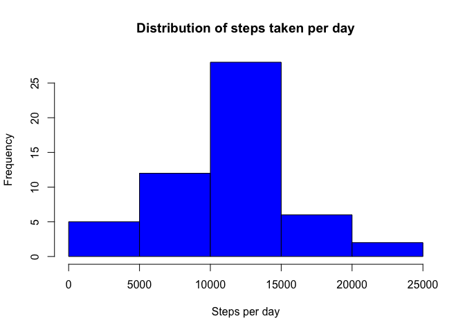
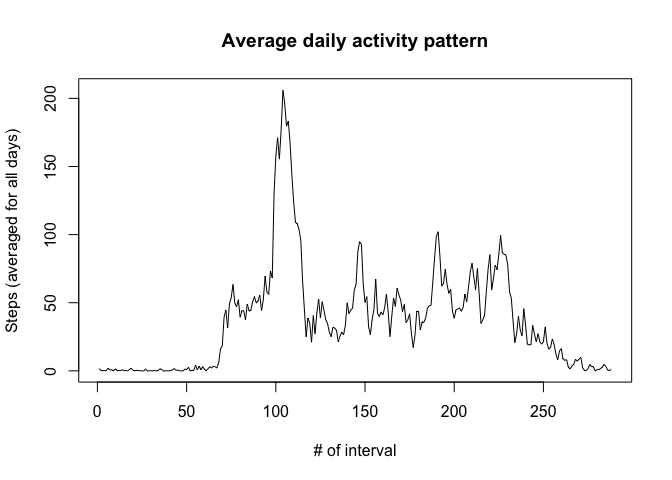
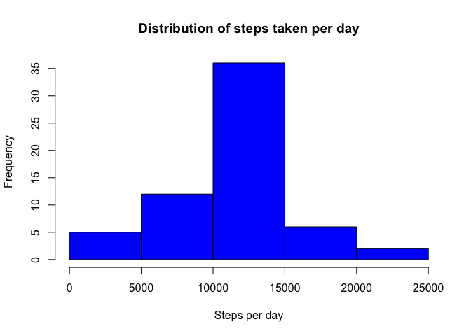
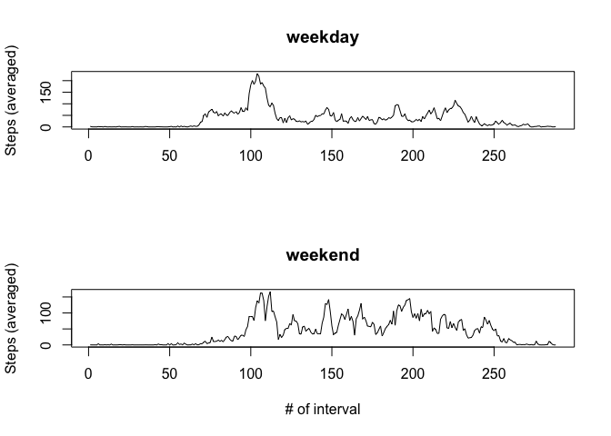

# Reproducible Research: Peer Assessment 1


## Loading and preprocessing the data

Load data:


```r
data <- read.csv("activity.csv")
```

Convert `date` column to the `Date` type for further processing:


```r
data$date <- as.Date(data$date, format = "%Y-%m-%d")
```

## What is mean total number of steps taken per day?

Histogram of the total number of steps taken each day:


```r
total_steps_per_day <- tapply(data$steps, data$date, sum)
hist(total_steps_per_day, main = "Distribution of steps taken per day", 
     xlab = "Steps per day", col = "blue")
```

\

Statistical parameters of steps per day:


```r
steps_per_day_mean <- mean(total_steps_per_day, na.rm = TRUE)
steps_per_day_median <- median(total_steps_per_day, na.rm = TRUE)
```

- mean: 10766.19
- median: 10765

## What is the average daily activity pattern?

The average daily activity pattern:


```r
avg_steps_per_interval <- tapply(data$steps, data$interval, mean, na.rm = TRUE)
plot(avg_steps_per_interval, type = "l", main = "Average daily activity pattern",
     xlab = "# of interval", ylab = "Steps (averaged for all days)")
```

\


```r
max_interval = names(avg_steps_per_interval[which.max(avg_steps_per_interval)])
```

The interval with maximum steps is: 835.

## Imputing missing values


```r
total_incomplete_cases = sum(!complete.cases(data))
```

Total number of rows with NAs: 2304.

We use interval average for all days to fill missing values.


```r
fdata <- data
for (i in 1:nrow(fdata)) {
    if (is.na(fdata[i, "steps"])) {
        fdata[i, "steps"] <- avg_steps_per_interval[as.character(fdata[i, "interval"])]
    }
}
```

Histogram of the total number of steps taken each day:


```r
total_steps_per_day <- tapply(fdata$steps, fdata$date, sum)
hist(total_steps_per_day, main = "Distribution of steps taken per day", 
     xlab = "Steps per day", col = "blue")
```

\

Statistical parameters of steps per day:


```r
steps_per_day_mean <- mean(total_steps_per_day, na.rm = TRUE)
steps_per_day_median <- median(total_steps_per_day, na.rm = TRUE)
```

- mean: 10766.19
- median: 10766.19


## Are there differences in activity patterns between weekdays and weekends?


```r
fdata$type = factor(sapply(weekdays(data$date), function(e) { 
    if (e %in% c("Saturday", "Sunday")) { "weekend" } 
    else { "weekday" }
}))

par(mfrow = c(2, 1))

weekday_data = fdata[fdata$type == "weekday",]
avg_steps_per_interval <- tapply(weekday_data$steps, weekday_data$interval, mean, na.rm = TRUE)
plot(avg_steps_per_interval, type = "l", main = "weekday",
     xlab = "", ylab = "Steps (averaged)")

weekend_data = fdata[fdata$type == "weekend",]
avg_steps_per_interval <- tapply(weekend_data$steps, weekend_data$interval, mean, na.rm = TRUE)
plot(avg_steps_per_interval, type = "l", main = "weekend",
     xlab = "# of interval", ylab = "Steps (averaged)")
```

\
